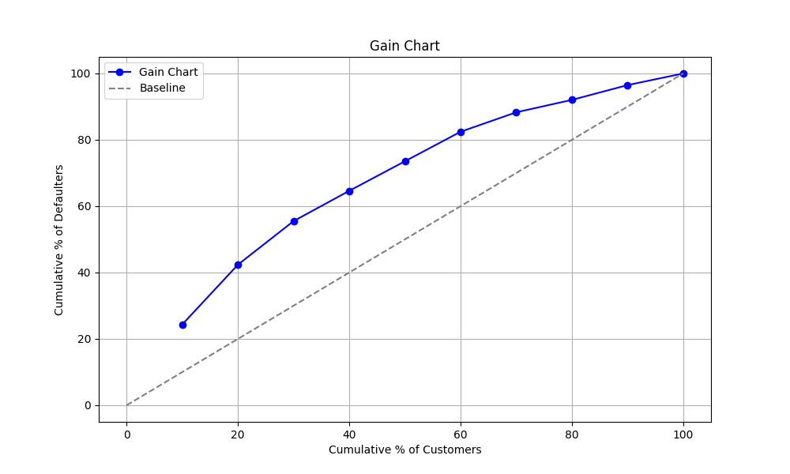
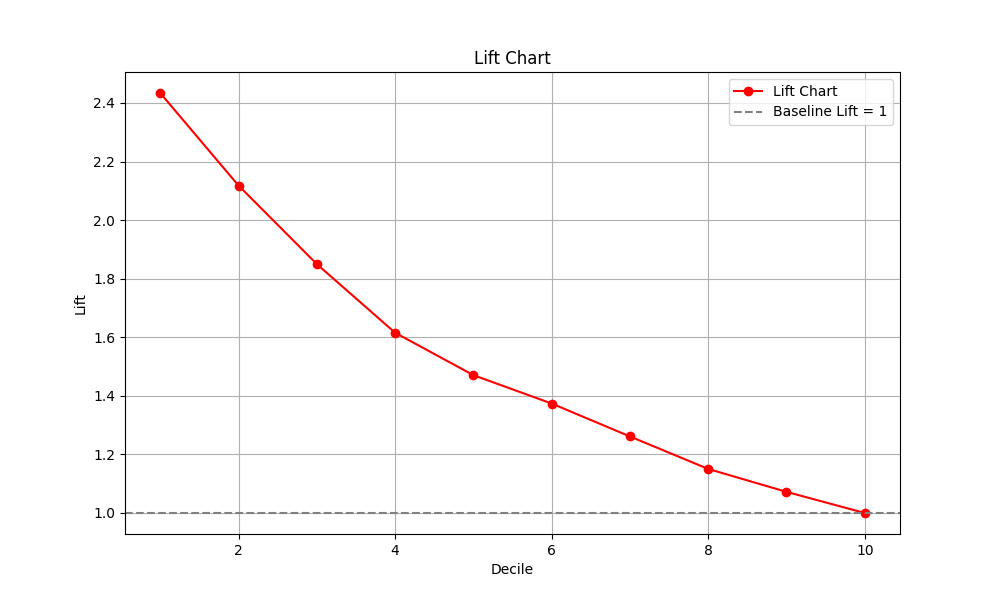

# 🏠 Scorecard Modeling for Home Loan Default Prediction

## 📌 Objective

Develop a predictive model to assess the creditworthiness of home loan applicants and generate a scorecard to optimize risk and maximize profitability by identifying potential defaulters.

---

## 📊 Dataset Overview

- **Source**: Kaggle
- **Records**: ~20,000 borrowers
- **Features**: 26 total columns; 25 independent features analyzed
- **Feature Selection**: Variables with Information Value (IV) > 0.02 were retained.

### Key Features Used:
- **Loan-to-Value Ratio**: % of asset cost already paid as down payment
- **Disbursement Amount**: Total loan credited to borrower's account
- **Vintage in Business**: Months since loan account opened
- **Down Payment**: Amount paid before loan was sanctioned
- **Distance from Office**
- **Asset Cost**
- **Tenure**: Loan repayment period in months
- **Years in Current Residency**
- **Earning Members**
- **FOIR**: Fixed Obligation to Income Ratio
- **Age**
- **Rate of Interest**

---

## 🔍 Inferences

- High risk of default if:
  - Distance > 25 km, Age > 50, and Asset Cost < ₹1.25M
  - Years in residency < 3 and Asset Cost > ₹1.5M
- Age 20–40 → High risk if interest rate > 17%
- Age > 46 → High risk if interest rate < 17%
- **Default Rate** highest among borrowers aged **>50 years**

---

## ⚙️ Modeling Approach

- **Algorithm**: Logistic Regression
- **Preprocessing**: Weight of Evidence (WOE) transformation
- **Probability Threshold**: 0.43 (based on Decile Analysis)

### Model Evaluation:
- **Confusion Matrix**
- **Decile Analysis**
- **Gain & Lift Charts**
- **KS Score**: 0.2829
- **Gini Score**: 0.3731

---

## 📈 Business Insights

### Before Applying Model:
- **Non-defaulted Interest Income**: ₹661.87M
- **Outstanding Amount to Recover**: ₹400.26M
- **Profit**: ₹261.6M
- **ROI**: 5.55%

### After Applying Model:
- **Non-defaulted Interest Income**: ₹499.51M
- **Outstanding Amount to Recover**: ₹196.73M
- **Profit from True Defaulter Identification**: ₹203.53M
- **Total Profit**: ₹343.95M
- **ROI**: 7.23%

### Overall Business Stats:
- **Total Disbursed**: ₹4.71B
- **Expected Interest**: ₹714.86M
- **Expected Recovery**: ₹5.43B
- **Net Profit**: ₹82.35M
- **Growth in Business**: **31.5%**

---

## 📊 Visuals

### Gain Chart

### Lift Chart

---

## ✅ Conclusion

The scorecard-based credit risk model effectively improves the default detection rate, enhances ROI, and supports informed lending decisions. Using WOE-based Logistic Regression and decile analysis enables actionable segmentation of borrowers.
